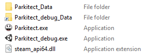
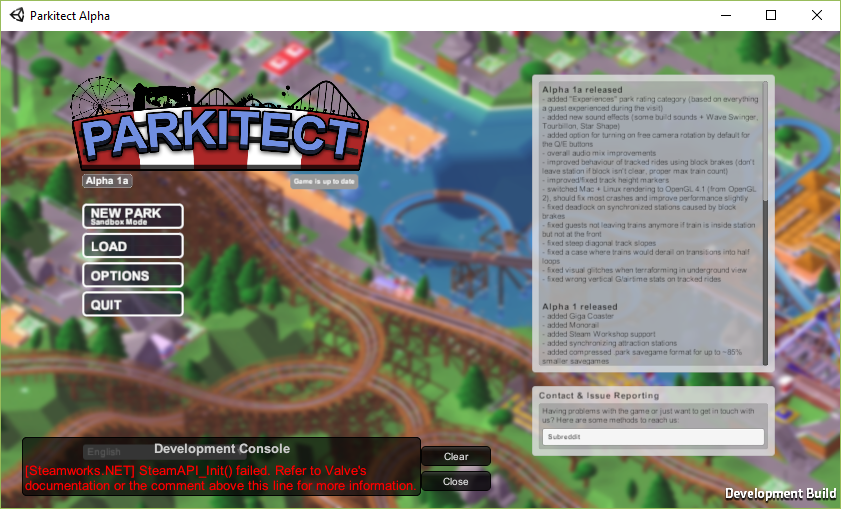
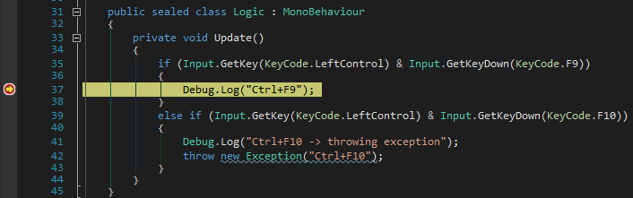

# Debugging Parkitect Mods

The easiest way to debug a mod is to extensively use logging via Debug.Log or similar methods. How to use logging is described [here](https://parkitectnexus.com/modding-wiki/Debugging).

Though for complex issue logging is quite pitiful and no replacement for a real debugger. Parkitect uses the Unity Engine, which contains a debugging system. Although Parkitect needs to be prepared for debugging by putting into Development mode.

This guide is based on [a forum post](http://forum.kerbalspaceprogram.com/index.php?/topic/102909-ksp-plugin-debugging-and-profiling-for-visual-studio-and-monodevelop-on-all-os/) by [sarbian](http://forum.kerbalspaceprogram.com/index.php?/profile/57146-sarbian/) who discovered how to debug mods for [Kerbal Space Program](https://kerbalspaceprogram.com). Since KBS as well as Parkitect are based on Unity this method works for Parkitect too (with slight adjustments).  
The forum post for Kerbal Space Program can be found [here](http://forum.kerbalspaceprogram.com/index.php?/topic/102909-ksp-plugin-debugging-and-profiling-for-visual-studio-and-monodevelop-on-all-os/).

## Parkitect Versions
Parkitect comes in multiple Versions: 32bit and 64bit, for Steam and without Steam (via Humble Bundle). Debugging works with all version, though there's a difference in the usage of x64 and x86. //Todo: beschreiben wann

## Prepare Parkitect
Before debugging Parkitect must put into Development mode to start its debugging server.

! You must have [the Parkitect Nexus Client](https://parkitectnexus.com/download-client) installed and started Parkitect at least once via Parkitect Nexus. This installs the Parkitect Nexus mod to Parkitect wich is used to load additional mods.

### Install Unity
First you need a Unity installation with the exact Unity engine version that was used for Parkitect. This version number can be found in the first line of `/Parkitect/Parkitect_Data/output_log.txt`.  
All Unity installers for final version can be found in the [Unity Download Archive](https://unity3d.com/get-unity/download/archive). Final versions are indicated by an **`f`** in the version number, like `5.3.4.`**`f`**`.1`. Additional there are [patch releases](https://unity3d.com/unity/qa/patch-releases) for Unity, indicated by **`p`**, like in `5.3.4.`**`p`**`.1`.  
In case of Parkitect Alpha 1a the first line of `output_log.txt` reads 

    Initialize engine version: 5.3.4p4 (43a3882ae25c)
and therefore you need the installer for [Unity 5.3.4p4](https://unity3d.com/unity/qa/patch-releases/5.3.4p4).

### Put Parkitect into Development Mode
After you installed Unity, go into its installation folder (default for Windows is `C:\\Program Files\Unity\Editor\`). Move down to `Data\PlaybackEngines\WindowsStandaloneSupport\Variation\win64_development_mono\` for Parkitect X64 and `Data\PlaybackEngines\WindowsStandaloneSupport\Variation\win32_development_mono\` for x86. Copy `player_win.exe` into your Parkitect folder (next to Parkitect.exe) and rename it to `Parkitect_debug.exe`.  
Now open a command prompt in that folder and execute `mklink /J Parkitect_debug_Data Parkitect_Data`. There's now a new folder called `Parkitect_debug_Data` that points to the `Parkitect_Data` folder.  


If you now start Parkitect via `Parkitect_debug.exe` the bottom right corner should read "Development Build".  
  
Additional there might appear a "Development Console" with some errors in the lower left. In the case of the image above Parkitect failed to initialize its Steam features, Since we launched Parkitect without using Steam that's ok -- just ignore the message.

### Make Parkitect listen to debug sessions
Next create a file called `PlayerConnectionConfigFile` (no extension!) in the folder `Parkitect/Parkitect_debug_Data` with the content `listen 12345 1 0` or download  [this PlayerConnectionConfigFile file](./data/PlayerConnectionConfigFile). On future launches of Parkitect via `Parkitect_debug.exe` the Parkitects mono debugger starts listen to debug sessions.

What does `listen 12345 1 0` in the `PlayerConnectionConfigFile` mean?
- `listen` tells the mono/unity debugger to start listen to debug sessions.   
   Its format is 
   ```
   listen <guid> <debugging> <waitonstartup>
   ```
- `guid` (here: 12345): Although it's depicted as "guid" it's really just a number -- in fact it doesn't even accept GUID in its usual form like "21EC2020-3AEA-4069-A2DD-08002B30309D". Another strange thing is inside the output_log.txt file it's labeled as "EditorId" while another (automatically created) number is displayed as "Guid".   
   That's why I guess the number just tells different game instance apart.
- `debugging` (here: 1): Either 0 or 1. Disables or enables the debugger.
- `waitonstartup` (here: 0): Either 0 or 1. It doesn't seem to have any impact on debugging a Parkitect mod. I guess it tells Unity directly at start to wait for a debugger to connect -- although it directly times out. The output_log.txt reads:
   ```
   Waiting for connection from host on [192.168.1.5:55374]...
   Timed out. Continuing without host connection.
   ```
   
Unity uses a remote debugger, that connects via IP and port. The Debugger should detect the game instance automatically, but if you ever need to find the used IP and Port these information are in the output_log.txt after you started Parkitect in Development Mode.

## Debugging in Visual Studio

### Install Tools for Unity
To enabled debugging Unity games from withing Visual Studio install ["Visual Studio Tools for Unity"](https://visualstudiogallery.msdn.microsoft.com/8d26236e-4a64-4d64-8486-7df95156aba9).

### Compile Mod
To actual debug a Mod we can't just use the compiled Library (dll) by the ParkitectNexus Client (located in /bin/ folder).  
First of all we must compile the mod in Debug Configuration. The Client compiles code for Release Build which optimates the code. We don't want this for debugging. So we compile the mod with Visual Studio in Debug configuration.  
We must tell ParkitectNexus to use that debug build instead of the version PN compiled. To do this change the path in `/bin/build.dat` (which usually points to the dll compiled by PN) to the compiled debug dll. (! Your project's root dir is the origin of this path, not the folder `./bin`)  
In case of [this example mod](https://github.com/Craxy/Parkitect-DebugMods) the mod project is in [`/src/DebugTestMod`](https://github.com/Craxy/Parkitect-DebugMods/blob/master/src/DebugTestMod) and it compiles to the default output path, which is `bin/Debug/`. In this case `.\src\DebugTestMod\bin\Debug\DebugTestMod.dll` must be put into `/bin/build.dat`.

If there's no `/bin/build.dat` file, just create it or compile it once with PN.

### Generate debug information
For debugging the executing mod library must be linked to the actual code. That's done via a special file with the necessary debug info. When building a project in the default debug configuration such a debug info file is automatically generated in the output folder besides the output dll. It has the same name as the dll, but the file extension is `pdb` ("Program Database").  
Unfortunately a pdb isn't directly compatible with mono/unity and therefore we need to create special debug information tailored for mono (`.mdb`). The `.pdb` file must be converted into a `.mdb` file. Mono provides such a tool called `pdb2mdb`. Mono is includes into the Unity installation -- but unfortunately the included pdb2mdb application isn't compatible with the dlls created by Visual Studio. Instead we use the pdb2mdb tool from the newest Mono version. [Download the newest Mono release](http://www.mono-project.com/download/) and install it. To create the `pdb` file go into the directory with your debug dll and execute
```
[Path\To\Mono]\bin\mono.exe [Path\To\Mono]\lib\mono\4.5\pdb2mdb.exe [YourAssemblyName].dll
```
The default installation path for mono is `C:\Program Files (x86)\Mono`. For my test project the corresponding command is
```
"C:\Program Files (x86)\Mono\bin\mono.exe" "C:\Program Files (x86)\Mono\lib\mono\4.5\pdb2mdb.exe" DebugTestMod.dll
```
(Quotation marks are necessary because the path contains spaces.)  

Instead of manually calling this command after every build this can be automated: Add as Post-build event (Project Properties -> Build Events)
```
[Path\To\Mono]\bin\mono.exe [Path\To\Mono]\lib\mono\4.5\pdb2mdb.exe "$(TargetFileName)"
```

### Debug your Parkitect Mod
Now you can start Parkitect in Developer Mode (via Parkitect_debug.exe) (make sure your mod is enabled in the Parkitect Nexus Client, the build.dat points to your debug build and the mdb file exists). In Visual Studio select in the Menu "Debug" -> "Attach Unity Debugger" and then Parkitect's Unity instance. There's just one instance to select if you debug locally and only have one instance of Parkitect (and no other game in development mode) open.

When the game reaches a break point Parkitect will break so you can debug through your mod.
